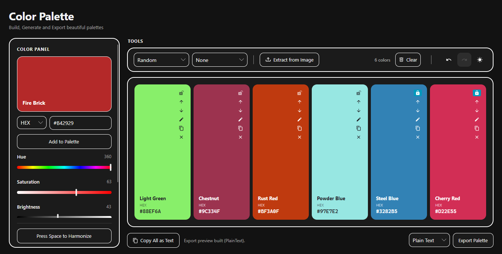
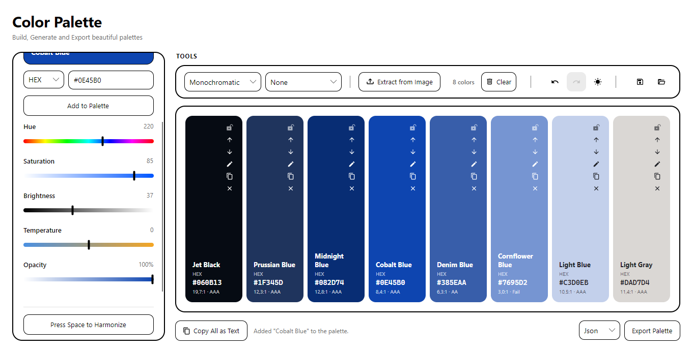

<div align="center">

# 🎨 Spectrum

**An intuitive color palette editor built with Avalonia UI. Create, generate, and export beautiful color palettes for your design projects.**

[](https://dotnet.microsoft.com/)
[](https://github.com/Megaloduck/Spectrum/actions/workflows/ci.yml)
[](https://avaloniaui.net/)
[](https://github.com/Megaloduck/Spectrum)
[](LICENSE)
[](https://github.com/Megaloduck/Spectrum/releases/latest)
[](https://github.com/Megaloduck/Spectrum/releases)
[](https://github.com/Megaloduck/Spectrum)
[](https://github.com/Megaloduck/Spectrum/issues)

</div>

<br/>

<!--
  Replace this with a real screenshot or GIF of the app in action.
  A short GIF of pressing Space and watching the palette shuffle is the
  single best piece of marketing this README can have.
  Suggested path: docs/demo.gif
-->
<p align="center">
  
  
</p>

<br/>

## ✨ Features

**Palette management (§1)**
- Palette **library sidebar**: create, inline-rename, duplicate, delete, **pin/favorite**, **search**, and filter (All / Pinned / Recent)
- **Autosave with dirty state** (750 ms debounce), atomic writes, **crash-recovery journal**, rotating **backups**, and **per-palette version history** with one-click restore
- **Tabs for open palettes**, whole-library import/export, and **detach a palette into its own window**

**Swatch & color editing (§2)**
- Full **spectrum picker dialog** (saturation/value plane + hue & opacity sliders) with **HEX / RGB / HSL / HSV input**, plus live **LAB/LCH/OKLCH readouts**
- Manual hex entry, alpha control, **copy in 9 formats**, **paste from clipboard** (any notation), swatch labels, duplicate, inline large preview

**Color picking (§3)**
- **System-wide eyedropper** with pixel-grid magnifier and **global hotkey** (default `Ctrl+Alt+P`, rebindable) — Windows native interop, fully local
- **In-app eyedropper** for exact pixels of any image, plus histogram-based extraction from images
- **Recent-picked-colors history** (persisted, click to reuse)

**Color science (§4)**
- Conversions: HEX, RGB, HSL, HSV, **LAB, LCH, OKLCH** — live in the inspector
- Harmonies: complementary, analogous, triadic, tetradic, split-complementary, monochromatic + random-with-lock
- **Tints / shades / tones** generators, palette-from-base, palette-from-image
- **WCAG AA/AAA** contrast checker *and* **APCA (Lc)** verdicts, live for the base color
- **Contrast matrix** — every text-on-background pair scored at once: color-coded WCAG cells, APCA in the tooltip, one-click CSV copy
- **Color blindness simulation** (Protanopia, Deuteranopia, Tritanopia, Achromatopsia)

**Import / export (§5–6, local files only)**
- Import: JSON, **CSS variables**, **GPL (GIMP)**, **ASE (Adobe)**, **ACO (Photoshop)**, image extraction
- Export: JSON, CSS, SCSS, **LESS**, Tailwind, **SVG**, **PNG swatch sheet**, **ASE / GPL / ACO**, plain text — copy to clipboard or save to file (the **Export workspace** holds the presets and preview)

**Desktop UX (§7)**
- **Four workspaces — Studio · Preview · Analyze · Export** (`Ctrl+1…4`): the top app bar switches the shell so each task only shows the panels it needs, instead of everything at once
- Sidebar + resizable/collapsible panels (splitters everywhere), **Ctrl+K command palette**, full keyboard-shortcut map, **tabs**, **system tray** with quick access, multi-window detach, rich **tooltips with color info**

**Preview & visualization (§8)**
- **Live UI mockup** (buttons, cards, body text) rendered in your palette
- **Side-by-side comparison** with any palette in the library, **swatch zoom view**, **contrast overlay badges** (WCAG + APCA) on every card
- **Row / Grid / List / Compact view modes**, **dark/light variant generator**
- Swatch cards read as **color + name + hex at rest**; the per-swatch action rail fades in on hover (lock stays visible)
- **Gradient studio** — multi-stop linear/radial gradients with a live CSS readout, **Copy CSS / Save SVG / Save PNG**, and one click to send the stop colors into the palette (undoable)

**Storage & settings (§9–10)**
- **JSON file storage** (default) and **SQLite** storage behind one interface, with migration between them; autosave, backups, version history, whole-library import/export
- Settings: theme, **accent color**, **density**, default copy/export formats, **hotkey configuration**, **storage location**, **reset / clear data**

**Technical (§11)**
- Cross-platform Avalonia UI (.NET 9), **MVVM** (CommunityToolkit), offline-first (**no background network calls**; update check runs only when you click it), accessibility labels on swatches, light/dark themes
- **xUnit test suite** over the color math, WCAG/APCA contrast, copy-format round-trips and every import/export codec (ASE/ACO/GPL/CSS/JSON), with **GitHub Actions CI** building and testing on Linux and Windows
- Studio-style monochrome UI driven entirely by a design-token stylesheet (`Styles/Theme.axaml`), with a runtime accent override

## 🛠️ Tech Stack

- [Avalonia UI](https://avaloniaui.net/) 11 (.NET 9, cross-platform desktop)
- MVVM via [CommunityToolkit.Mvvm](https://learn.microsoft.com/dotnet/communitytoolkit/mvvm/) source generators (`[ObservableProperty]`, `[RelayCommand]`)
- [Material.Icons.Avalonia](https://github.com/SKProCH/Material.Icons) for iconography

## 🚀 Getting Started

### Prerequisites

- [.NET 9 SDK](https://dotnet.microsoft.com/download/dotnet/9.0)

### Run it

```bash
git clone https://github.com/Megaloduck/Spectrum.git
cd Spectrum
dotnet restore
dotnet run --project Spectrum.csproj
```

Or open `Spectrum.slnx` in your IDE of choice (Visual Studio, Rider, VS Code) and hit run.

## ⌨️ Usage

| Action | How |
|---|---|
| Generate a new palette | Press `Space`, or click **Press Space to Harmonize** |
| Lock a color | Click the lock icon on a swatch |
| Reorder colors | Drag a swatch card (any view mode) |
| Simulate color blindness | **Analyze** workspace (`Ctrl+3`) → **Color Blind** dropdown in the toolbar |
| Extract colors from an image | **Extract from Image** in the toolbar |
| Build a gradient | **Gradient** in the Studio toolbar (`Ctrl+1`) → copy CSS, save SVG/PNG, or add its stops to the palette |
| Score every color pair | **Matrix** in the Analyze toolbar (`Ctrl+3`) → WCAG cells + APCA tooltips + CSV copy |
| Screen eyedropper | **Screen** button or `Ctrl+Alt+P` (click anywhere to pick) |
| Export a palette | **Export** workspace (`Ctrl+4`) → build a preview, copy, **Save to file…** or **PNG sheet…** |
| Command palette | `Ctrl+K` |
| Switch workspace | `Ctrl+1` Studio · `Ctrl+2` Preview · `Ctrl+3` Analyze · `Ctrl+4` Export |
| Undo / redo | `Ctrl+Z` / `Ctrl+Y` |
| Save / load a palette file | `Ctrl+S` / `Ctrl+O` |
| New palette | `Ctrl+N` |
| Duplicate / delete selected swatch | `Ctrl+D` / `Delete` |
| Open color picker | Click the big base-color preview, or the palette icon on a swatch |
| Collapse library / inspector | `Ctrl+B` / `Ctrl+I` |
| Settings | `Ctrl+,` |
| Export to file / PNG sheet | `Ctrl+E` / `Ctrl+J` |

## 🤝 Contributing

Contributions are welcome! Feel free to open an [issue](https://github.com/Megaloduck/Spectrum/issues) or submit a [pull request](https://github.com/Megaloduck/Spectrum/pulls).

## 📄 License

This project is licensed under the MIT License — see the [LICENSE](LICENSE) file for details.

---

<div align="center">
  Made by @Megaloduck with ❤️ using Avalonia UI
</div>
